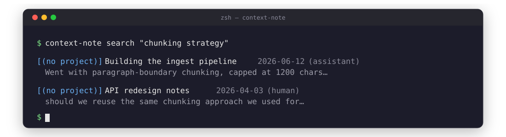
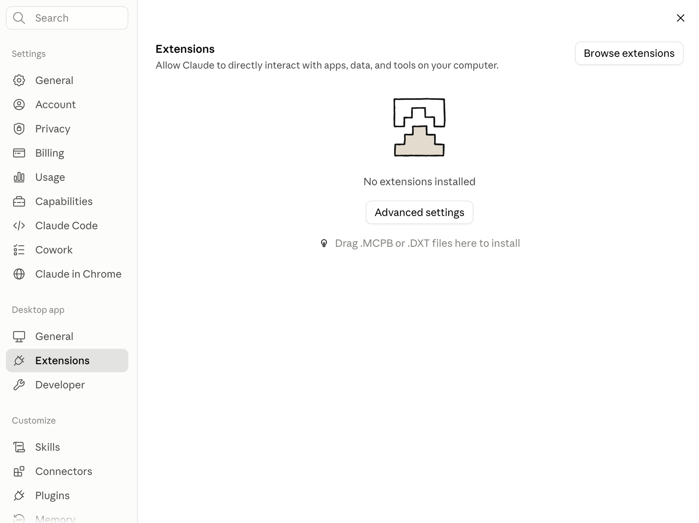
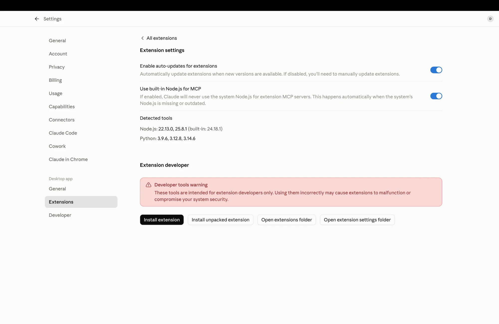
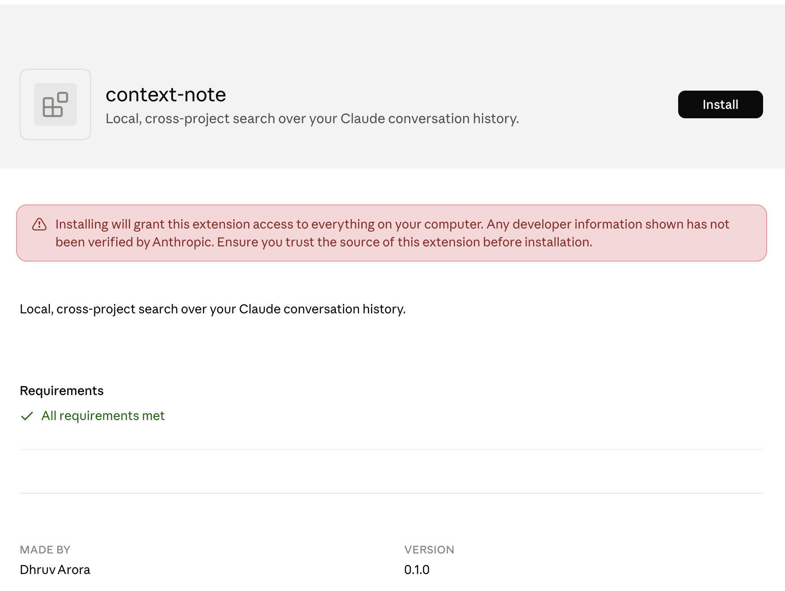
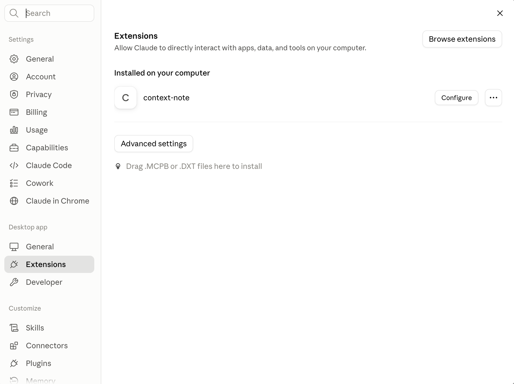
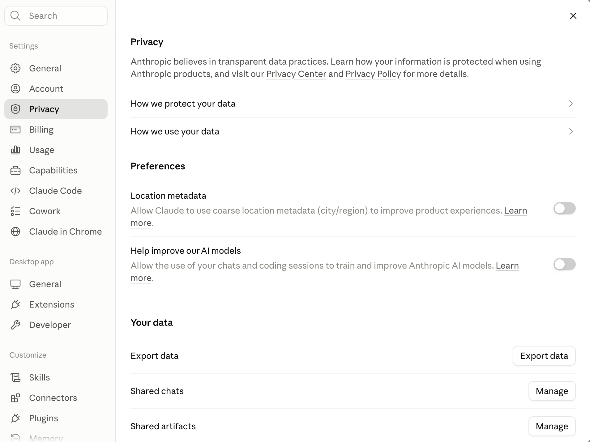
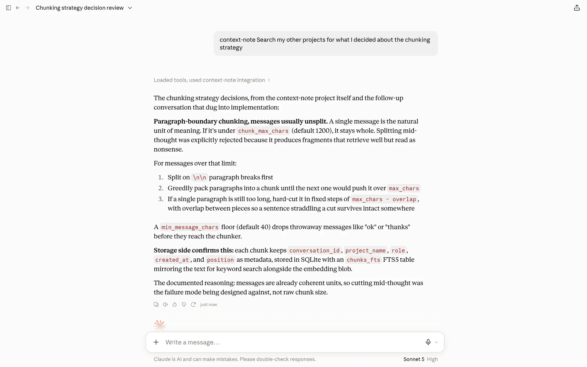
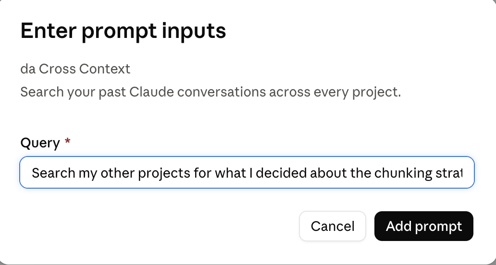

# context-note



[](https://github.com/DhruvvArora/context-note/actions/workflows/tests.yml)
[](LICENSE)

Local, cross-project search over your Claude conversation history, exposed to Claude Desktop as an MCP server.

[Why](#why) · [Example](#example) · [Install](#install) · [Load your history](#load-your-history) · [Use](#use) · [How it works](#how-it-works) · [Configuration](#configuration) · [Limits](#limits)

## Why

Claude scopes context strictly. Each project has its own memory space, and chat search only looks inside the project you are currently in (or, outside a project, only at non-project chats). That isolation is usually what you want. Sometimes it isn't: the thing you need is in a different project, or in a one-off chat you never filed anywhere.

There is no built-in way to bridge that. context-note builds a local index of your full history and hands Claude a search tool that ignores project boundaries, so you can pull context in deliberately without reorganizing anything.

Everything runs on your machine. No API keys, no accounts, nothing leaves the device.

## Example

```
$ context-note search "chunking strategy"

[(no project)] Building the ingest pipeline  2026-06-12  (assistant)
  Went with paragraph-boundary chunking, capped at 1200 chars -- messages
  under that never get split, and the FTS5/embedding fusion handles the rest.

[(no project)] API redesign notes  2026-04-03  (human)
  should we reuse the same chunking approach we used for the ingest pipeline,
  or is this different enough to need its own pass?
```

That `(no project)` is real, not a placeholder -- see "Project attribution
doesn't survive this export flow" below for why. Same query works inside a
Claude Desktop chat, where Claude calls the `search_context` tool directly
instead of you running the CLI.

## Install

```bash
git clone https://github.com/DhruvvArora/context-note
cd context-note
pip install -e .
context-note init
context-note install             # registers the MCP server with Claude Desktop
context-note install --service   # runs the watcher in the background
```

Restart Claude Desktop.

<details>
<summary><strong>If Claude Desktop doesn't pick up the server</strong> (config silently ignored on some builds -- click to expand)</summary>

`context-note install` registers the server the classic way, by writing to
`claude_desktop_config.json`. On newer ("Cowork") Claude Desktop builds this
can silently not work: local MCP server support there is sometimes
feature-gated off entirely, independent of what's in the config file — the
app just shows "No servers added" no matter what the file contains, and
`~/Library/Logs/Claude/mcp.log` stays empty because it never even attempts
to load anything.

If that's what you're seeing, `context-note install` already built a
fallback for you: `~/.context-note/context-note.mcpb`, a Desktop Extension
bundle — a separate, currently-working install path on the same builds
(macOS also reveals it in Finder automatically after `install` runs).

1. Click your profile in the bottom-left of Claude Desktop and open **Settings**.
2. Go to **Extensions**, then drag `context-note.mcpb` onto the drop zone.

   

3. If drag-and-drop doesn't work in your setup, use **Advanced settings → Install extension** instead and pick the file from Finder (`~/.context-note/context-note.mcpb`).

   

4. Review the install prompt and confirm.

   

5. It now shows up under **Installed on your computer**. Click **Configure** if you want to restrict which tools it's allowed to call (`search_context`, `get_conversation`, `index_stats`).

   

To rebuild it by hand (a custom output path, after moving your venv, etc.)
without re-running the rest of `install`:

```bash
python packaging/mcpb/build.py
```

No Node/npm needed — see [`context_note/mcpb.py`](src/context_note/mcpb.py)
for how the bundle gets built and a macOS permissions gotcha: a sandboxed
Python subprocess can get denied access to a venv living under
`~/Documents`, `~/Desktop`, or `~/Downloads` even after granting Claude
itself folder access. The fix is granting that specific Python binary its
own access under System Settings → Privacy & Security → Files & Folders.

</details>

## Load your history

There is no API for reading your claude.ai conversations, so the export itself
stays manual:

1. In Claude, go to **Settings > Privacy**, then click **Export data** next to "Your data."

    Privacy panel, showing the Export data button under Your data" width="600">

2. Pick a date range and click **Export**.
3. Wait for the email and click through. Anthropic's own copy says this "typically takes a few hours but may take up to 12 hours depending on the size of your data" -- in practice it's usually been quick, but don't be surprised if a large history takes a while.

Triggering the export itself isn't automated by context-note: doing so would
mean driving claude.ai's internal, undocumented endpoints with your session
cookie, which breaks whenever the frontend changes and puts every user's
session token in the blast radius for a public tool. One click a month is
the better trade.

> [!TIP]
> Don't want to click through any of it yourself? Claude Desktop's Computer
> Use (or Cowork) can run the whole request-and-download flow for you --
> including finding the resulting email -- if you paste in a ready-made
> script. See **[Automate this with Computer Use](#automate-this-with-computer-use)** below.

Everything from here on *is* automatic. With the watcher running, once the
manifest email's file lands in `~/Downloads`, the watcher spots it, opens
the download link for you, waits for the file to finish downloading, and
indexes it -- you never move a file or run `ingest` by hand.

<details>
<summary>What actually happens after you click Export (manifest format, auto-open, re-exports)</summary>

The current export flow emails a `manifest-*.json` rather than a zip
directly -- that manifest lists several category files (`conversations`,
`projects`, `users`, `memories`), each behind a one-time-use signed URL:

```json
{
  "category": "conversations",
  "export_url": "https://claude.ai/export/.../download/...",
  "filename": "conversations-000.zip"
}
```

With the watcher running, you don't need to open that file yourself: once
the manifest lands in `~/Downloads`, `handle_manifests()` in `watch.py`
opens the conversations `export_url` in your default browser for you. That
still needs your logged-in session to actually complete the download (it's
launching a URL, not scripting a request), so it's a real click either way
-- but it's the browser tab that opens for you, not a JSON file you have to
read. Set `auto_open_export_manifest` to `false` in
`~/.context-note/config.json` to find and open that link by hand instead.

```bash
context-note watch                  # foreground, ctrl-c to stop
context-note watch --dir ~/Desktop  # watch somewhere else, repeatable
context-note watch --once           # single pass, useful in cron
```

`install --service` registers it as a launchd agent on macOS or a systemd user
unit on Linux, so it survives reboots. On Windows, register `context-note watch`
with Task Scheduler.

Re-export whenever you want to refresh. Exports are full snapshots, so
re-ingesting replaces prior copies of the same conversations rather than
duplicating them, and the watcher skips a file it's already ingested --
by content hash, not filename, since Anthropic reuses the same filename
(`conversations-000.zip`) for every export.

</details>

### Project attribution doesn't survive this export flow

Search results and `--exclude-project`/`project` filtering will show
`(no project)` for anything ingested from the current export flow, even for
conversations you've organized into projects in the app. This isn't a
context-note bug: the `conversations-*.zip` no longer carries any
project reference on each conversation, and the `projects-*.zip` (project
names/descriptions) has no conversation-membership field either. Checked
both directly -- there is currently no data in the export that links the
two, so there's nothing for the parser to recover. If Anthropic adds that
link back to the export schema, `parser.py`'s `parse_conversations()` is
where to wire it back in.

### Automate this with Computer Use

<details>
<summary><strong>Tip: drive the whole export request with Computer Use</strong> (click to expand a ready-to-paste script)</summary>

The manual steps above -- requesting the export, then finding the email and
downloading the file -- can themselves be driven by Claude Desktop's
Computer Use (Beta), so you never have to leave the chat. Two ways to point
it at claude.ai:

- **Claude Desktop's built-in Browser pane.** This is a clean browser profile
  with none of your saved logins, so it needs you to sign in once per
  session before it can reach your account settings. Generic browser control
  through Computer Use is also capped at view-only by app-category
  permissions (confirmed live: an installed browser without the extension,
  e.g. Brave, gets the same restriction), so the final "Export" click still
  needs a real approval from you -- Claude can get you to that button, but
  can't complete a consequential click unsupervised.
- **The Claude in Chrome extension**, if you have actual Chrome installed
  with the extension enabled. This shares your real, already-logged-in
  Chrome session instead of a separate sandboxed profile, so there's no
  sign-in step and it isn't subject to the browser-tier view-only cap the
  same way -- Claude can act in your logged-in tab directly. Use this over
  the Browser pane when it's available.

If Claude Desktop also has a Gmail connector enabled for the account the
export email goes to, it can go one step further: find the "Your data is
ready for download" email itself and open the download link, so the only
thing you do by hand is drop the resulting file into `~/Downloads` (or let
the watcher's default location already cover it). One real gotcha from
using this live: the download link inside that email is **single-use** --
clicking it a second time (even by accident, e.g. a mail client's own link
scanner opening it, or Claude retrying after a page that just looked
unfinished) burns it, and it comes back as "expired -- please request a new
export." If that happens, the fix is just requesting a fresh export, which
emails a new, unused link.

Either way, paste something like this into a Claude Desktop chat to run the
whole thing with minimal back-and-forth:

```
Use Computer Use (and Gmail, if connected) to get me a fresh claude.ai data
export end to end:

1. Open claude.ai and go to Settings > Privacy > Export data (sign in first
   if you land on a login screen -- that's expected, go ahead).
2. Click "Export data" / "Request export".
3. If a dialog asks you to confirm the export request (or to replace an
   existing pending request), confirm it -- yes, proceed, this is intentional.
4. Once the request is submitted, check Gmail for an email from Anthropic
   titled "Your data is ready for download" -- this can take a few minutes,
   so if it's not there yet, stop and tell me instead of repeatedly
   re-checking. Use the most recent matching email if there's more than one.
5. Open the download link from that email exactly once. It's single-use --
   if it comes back "expired" or "already used," don't retry it or search
   for another old email; tell me and I'll decide whether to request a new
   export.
6. Once the file downloads, stop -- context-note's watcher picks it up from
   ~/Downloads automatically from there.

Treat every confirmation dialog in this flow as pre-approved and answer
"yes" / "export" / "confirm" without asking me first. Only stop and ask if
something doesn't match this -- an error, a CAPTCHA, an expired/used link,
or a page that isn't what's described above.
```

Worth being honest about the limits of that script: Anthropic's own
consequential-action confirmation (the "are you sure" checkpoint Claude
shows before an irreversible click, including the download itself) is a
platform-level safety behavior, not something a pasted prompt can configure
away. Pre-answering the expected checkpoints above cuts most of the
back-and-forth, but expect Claude to still surface a couple of built-in
confirmations along the way regardless -- a real approval or two per
export, same as clicking through by hand, just without having to navigate
there yourself.

</details>

## Use

Two ways to trigger it inside a Claude Desktop chat:

- **Just ask, but name context-note explicitly.** Claude has its own native
  chat-history search, and if you don't name the tool it can quietly use
  that instead of context-note's cross-project one:

  > Use context-note to search my other projects for what I decided about the chunking strategy.

  

- **Or use the "Cross Context" prompt.** Click **+ → Add from context-note
  → Cross Context** and just fill in what you're searching for -- the
  template already reads "Use context-note to search my other projects and
  non-project chats for: ...", so you only type the query itself, not the
  whole sentence.

  

Either way, Claude calls `search_context`, gets ranked snippets with project and date, and can call `get_conversation` to pull a full thread when a snippet is cut off.

From the terminal:

```bash
context-note search "chunking strategy"
context-note search "auth flow" --exclude-project "Job Search"
context-note stats
```

### Commands

| Command | What it does |
| --- | --- |
| `context-note init` | creates `~/.context-note/` and a default `config.json` |
| `context-note install` | registers the MCP server with Claude Desktop (and builds the `.mcpb` fallback) |
| `context-note install --service` | also installs the watcher as a background service (launchd/systemd) |
| `context-note watch` | runs the watcher in the foreground; `--dir` to add a folder, `--once` for a single pass |
| `context-note search <query>` | searches from the terminal; `--exclude-project` to filter, `--limit` to cap results |
| `context-note stats` | chunk/conversation counts and the indexed date range |

## How it works

```
~/.context-note/
  imports/      drop export zips here
  processed/    ingested zips move here
  index.db      SQLite: chunks, FTS5, embeddings
  config.json
```

Retrieval is hybrid. BM25 over FTS5 handles proper nouns, error strings, and identifiers. Dense vectors from a local sentence-transformers model handle vague callbacks. The two rankings are fused with Reciprocal Rank Fusion.

Embeddings are stored as float32 blobs and scored in Python rather than through a compiled vector extension. That costs some speed above roughly 100k chunks and buys a `pip install` that works everywhere, which for a local tool is the better trade.

## Configuration

Edit `~/.context-note/config.json`:

| Key | Default | Notes |
| --- | --- | --- |
| `embedding_model` | `all-MiniLM-L6-v2` | any sentence-transformers model |
| `chunk_max_chars` | 1200 | messages under this are never split |
| `min_message_chars` | 40 | drops "ok", "thanks" |
| `excluded_projects` | `[]` | project names to never index |
| `auto_open_export_manifest` | `true` | open the conversations link from an export manifest automatically |

Use `excluded_projects` for anything you want to stay siloed. The point is opt-in bridging, not a global dump.

## Limits

- Claude Desktop only. Browser claude.ai reaches remote connectors over HTTPS, not local stdio servers. A remote mode is plausible later; the retrieval layer is transport-agnostic on purpose.
- Ingestion is batch. Requesting the export takes one manual click, downloading the conversations file from the resulting manifest takes another (see "Load your history"); everything after that is automatic.
- No project attribution. The current export flow doesn't include any link between a conversation and the project it's filed under, so results always show `(no project)` and project filtering is a no-op regardless of how you've organized chats in the app. See "Load your history" above.
- The export schema is undocumented and can change. The parser skips shapes it does not recognize rather than failing, but a large format change will need a fix -- as happened with the move to the manifest + per-category zip format.

## License

MIT
